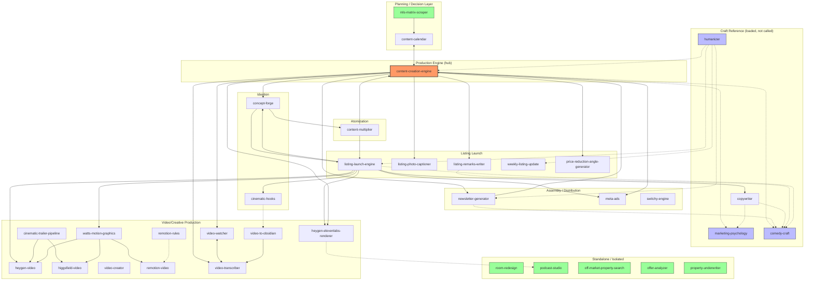

# Skills Dependency Audit — 2026-07-28

Video/Creative (13) + Real Estate Content (17) skill groups. Maps all 30 skills flagged as "left untouched" in the last /doctor pass — dependency graph, coupling analysis, consolidation proposals, description trims, dead-weight calls.

**Status as of 2026-07-28 (approved by Graeham):**
- ✅ `content-multiplier` deleted — zero inbound callers found anywhere in the tree; confirmed dead weight, not just unwired.
- ✅ `listing-launch-engine` description trimmed (~300 chars cut: removed the duplicated shot-type inventory and the delivery-mechanism clause, both already stated in the SKILL.md body). Trigger-phrase list and all three scope-boundary sentences ("does not auto-edit," "does not remember prior runs," "does not build the avatar," "One listing per run") were preserved untouched.
- ⏳ Not yet actioned: the `remotion-video`↔`remotion-rules` cross-reference addition, the `heygen-video`↔`heygen-elevenlabs-renderer` cross-reference addition, and the `watts-motion-graphics`/`remotion-video` reference de-duplication — these remain open proposals below, not yet approved for action.

---

## 1. Dependency Graph

**Legend:** solid arrow = functional call/handoff; dotted arrow = "loads as reference" or soft pairing. Orange = the central hub. Blue = reference-only (never produce deliverables themselves). Green = genuinely standalone.

### Notable chains
- **Listing pipeline (most complex):** `concept-forge → content-multiplier → content-creation-engine (fed mode) → listing-launch-engine/packager → switchy-engine / GHL / meta-ads`. This exact chain is spelled out verbatim in `content-multiplier`'s own SKILL.md.
- **Planning → production:** `mls-matrix-scraper → content-calendar → content-creation-engine`, with a documented two-way "Scope Boundary" table between content-calendar and content-creation-engine (duplicated in both files — see risk note below).
- **Video render pipeline:** `content-creation-engine`/`listing-launch-engine` write scripts → `heygen-elevenlabs-renderer` (auto SSML→ElevenLabs→HeyGen) or `heygen-video` (manual avatar picks) → composited with `higgsfield-video` b-roll and `watts-motion-graphics` overlays in CapCut.
- **Video research pair:** `video-watcher` (visual) and `video-transcriber` (words) are explicit bidirectional siblings with matching "trigger boundary" tables in both files; `content-creation-engine` calls both as "external dependencies" it used to own internally.

---

## 2. Standalone vs. Tightly Coupled

### Genuinely standalone (safe to touch/refactor in isolation)
| Skill | Why |
|---|---|
| `room-redesign` | Zero inbound callers anywhere in the tree; only outbound mention is a one-line "this is images not video" disambiguation. Arguably miscategorized as "video group" — it's image-only. |
| `podcast-studio` | Nothing calls it (terminal personal-use skill); it calls out to `humanizer`, `website-crawler`, `founder-academy`, `heygen-elevenlabs-renderer` but nothing calls in. |
| `off-market-property-search` | Fully self-contained scraper + branded report generator, no cross-refs either direction. |
| `offer-analyzer` | Self-contained two-mode tool, no inbound or outbound refs to the other 16 real-estate skills. |
| `property-underwriter` | Standalone relative to this group (real dependency is `xlsx`, outside scope). |
| `mls-matrix-scraper` | Pure scraper; content-calendar reads its JSON output but it calls nothing itself. |
| `weekly-listing-update` | Only touches the cross-cutting `humanizer` utility; own data pipeline, own publish flow. |
| `listing-photo-captioner` | Explicitly documented as running independently of listing-remarks-writer despite the natural pairing ("They run independently"). |
| `remotion-rules` | Pure lookup index (38 rule files); one-directional reference to remotion-video, nothing calls it in. |

### Tightly coupled hubs (edit with care — wide blast radius)
| Skill | Coupling |
|---|---|
| `content-creation-engine` | **The central hub of the entire 30-skill set.** 25+ other skills reference it (inside and outside these two groups). Any interface change here has the widest blast radius in the tree. |
| `heygen-video` | 9 external callers (vaibhav-template, watts-motion-graphics, transcript-repurposer, listing-launch-engine, cinematic-trailer-pipeline, meta-ads, room-redesign, concept-forge, content-creation-engine). |
| `content-calendar` ↔ `content-creation-engine` | Explicit bidirectional "Scope Boundary" table in **both** files — the cleanest deliberate split in the whole set, but duplicated prose = consistency risk if one is edited without the other. |
| `listing-launch-engine` | Coupled to concept-forge, content-creation-engine, content-multiplier, comedy-craft, cinematic-hooks, watts-motion-graphics, heygen-video/heygen-elevenlabs-renderer, humanizer, copywriter, meta-ads. |
| `content-multiplier` | Almost pure middleware — explicitly owns nothing itself, sits between concept-forge and listing-launch-engine. **Flag:** zero inbound references found anywhere — may be spec-only / not yet wired into real runs (worth confirming with you). |
| `heygen-elevenlabs-renderer` | Documented downstream execution layer for content-creation-engine's v5.4/V6 scripts; cited by podcast-studio for shared SSML facts. |
| `video-watcher` ↔ `video-transcriber` | True sibling pair, matching trigger-boundary tables duplicated in both files. |
| `marketing-psychology` / `comedy-craft` | Reference-only "twins" (persuasion vs. humor) — not coupled by function, but loaded by nearly every content-producing skill (content-creation-engine, newsletter-generator, listing-remarks-writer, listing-launch-engine, copywriter, content-multiplier, concept-forge). |
| `higgsfield-video` / `cinematic-hooks` | No outbound refs in their own bodies, but 5-6 external skills call into each as the shared b-roll/prompt execution engine. |

---

## 3. Consolidation / Combination Proposals

These are proposals, not actions — flagging where real overlap exists.

1. **`remotion-video` + `remotion-rules` → keep separate, but tighten the link.** `remotion-rules` already calls itself a "lookup reference... pairs with remotion-video," but `remotion-video`'s own file never reciprocates or mentions `remotion-rules` at all. This is a one-directional gap, not true overlap — recommend adding one sentence to `remotion-video` pointing at `remotion-rules` for best-practices lookup, rather than merging (they serve different purposes: generator vs. reference index).

2. **`watts-motion-graphics` vs. `remotion-video` — genuine overlap, not accidental.** `watts-motion-graphics` explicitly is the Watts-brand specialization of generic Remotion ("Generic Remotion projects (non-Watts brand) → use `remotion-video`"). Both files independently duplicate a fair amount of generic Remotion component/aspect-ratio boilerplate that `remotion-rules` already indexes in depth. Proposal: strip the duplicated generic-Remotion reference material out of `remotion-video`'s body and point it at `remotion-rules` instead, leaving `remotion-video` as a thinner project-scaffolder and `watts-motion-graphics` as the only brand-specific layer. No functional merge needed — just de-duplication of reference content.

3. **`copywriter` / `marketing-psychology` / `comedy-craft` — do NOT merge.** This looks like three overlapping "writing help" skills but is actually a deliberately documented, clean division of labor (copywriter = deliverable + format/variant engine; marketing-psychology = persuasion diagnosis; comedy-craft = humor calibration), explicitly spelled out in marketing-psychology's own file. This is good architecture, not overlap — flagging only so it's not mistakenly "simplified" away.

4. **`heygen-video` / `heygen-elevenlabs-renderer` — clarify the split, don't merge.** Both render HeyGen avatar video, but heygen-video is the manual/interactive job (Claude asks which avatar, submits, tracks) while heygen-elevenlabs-renderer is the fully automated SSML→ElevenLabs→HeyGen pipeline for content-creation-engine's v5.4/V6 scripts specifically. They're both legitimately load-bearing render endpoints for different callers (9 callers use heygen-video; content-creation-engine/podcast-studio/listing-launch-engine use heygen-elevenlabs-renderer for the automated path). Recommend keeping both, but adding one explicit cross-reference line in each pointing at the other so a reader landing on either knows the other exists and why.

5. **`content-multiplier` — confirm it's live before investing more in it.** It has a fully-specified, well-written SKILL.md sitting "between" concept-forge and listing-launch-engine, but nothing in the tree calls into it yet. Before folding effort into further wiring it, worth a quick check with you: is this actually used in real listing launches today, or is it a designed-but-not-yet-adopted layer? If unused, it's the closest thing to "dead weight" found in either group — though it reads as forward-looking infrastructure, not abandoned cruft.

6. **`room-redesign` — reconsider its grouping, not its content.** It has zero ties to the other 12 video skills (image-only, no inbound/outbound refs). No change needed to the skill itself, but if you ever do a folder/category reorg, it belongs closer to a general "AI image generation" bucket than the cinematic-video cluster.

---

## 4. Safe Description-Trim Proposals

Only trimming content that's duplicated elsewhere in the same file's body or is pure descriptive color — never touching trigger-phrase lists or scope-boundary/routing sentences.

| Skill | Current length | Trim proposal | What must stay |
|---|---|---|---|
| **`listing-launch-engine`** | 2,181 chars | Cut the parenthetical shot-type inventory ("the 4-photo status set, reveal cuts, walkthrough, neighborhood B-roll, open-house clips" — duplicates the body's "It produces three things" list) and the delivery-mechanism clause ("Output is a visual HTML dashboard... distributed as a Gmail draft" — duplicates Step 9). Est. **300–400 char cut**, ~15-18%. | Full trigger-phrase enumeration (routing depends on it); the three boundary sentences — "does not auto-edit," "does not remember prior runs (that is PropertyIQ's job)," "does not build the avatar," "One listing per run." |
| **`meta-ads`** | 1,414 chars | Minor trim of the long trailing trigger-phrase run-ons is possible but risky — this is Meta's own paid-ads vocabulary and likely tuned for real trigger accuracy. Recommend **no trim** unless you specifically want it shorter; flagging only because it's the 2nd-longest. | Everything — this one's length is functional, not padding. |
| **`property-underwriter`** | 1,526 chars | The "Design note" self-justification vs. Anthropic's generic financial-analysis plugin is unusually long for a description but is genuinely load-bearing (explains why this skill exists rather than a built-in). **No trim recommended.** | — |
| **`cinematic-trailer-pipeline`** | ~840 chars | Body (not description) has a trimmable "Honest reality checks" section (character-drift caveats, cost estimates) that could move to a reference file. Description itself is already tight — no cut needed. | Hand-off contract / routing-away sentence to heygen-video and higgsfield-video. |
| **`podcast-studio`** | ~640 chars | Body's SHOW REGISTRY entries (business data, not orchestration) are candidates to move to a reference file, shrinking the SKILL.md body — description itself is fine as-is. | GLOBAL HARD RULES (esp. the iTunes re-sync fix and mandatory humanizer pass). |
| **`video-creator`** | ~640 chars | Body has detailed per-template JSON config examples that could move to `references/` without affecting how other skills invoke it. | The "no external tools or local setup needed" framing — remotion-video's fallback routing depends on this exact characterization. |
| All others (17 remaining) | — | No trims proposed — bodies scale sensibly with description length (92–636 lines), and none showed daylight between what's claimed and what's delivered. | — |

**General pattern:** across both groups, the safe-to-trim material is consistently *changelog/historical narration* ("formerly listing-call-sheet," "absorbed video-script-creation-engine in April 2026," "First built file:...") and *duplicated descriptive detail* that repeats the SKILL.md body almost verbatim in the frontmatter description. Trigger-phrase lists and any sentence containing "does NOT," "CALLED BY," "owns," "route to," or a Scope Boundary/Architecture table were never proposed for trimming — those are the load-bearing routing text you flagged as the risk.

---

## 5. Dead Weight

**Nothing in either group is unambiguous dead weight.** Both groups are unusually well-maintained — every skill has at least one genuine inbound or outbound tie, or is intentionally standalone by design (room-redesign, podcast-studio, the five real-estate standalone tools). Two things worth a closer look, not deletion:

- **`content-multiplier`** — fully speced, zero inbound callers found. **Deleted 2026-07-28** per Graeham's approval; no other skill referenced it, so removal was clean.
- **`remotion-rules`** — thinnest SKILL.md body of the 30 (70 lines), but this is by design (it's a pure index into 38 `rules/*.md` files that weren't read in this pass). Not dead weight, just flagging that its real substance lives outside the file that was audited here.
- **One unverifiable grep hit:** `context-engineer/SKILL.md` matched "video-creator" during the scan but the surrounding content appeared to be binary/non-UTF8 at that location — worth a manual check outside this audit, not a finding in itself.

---

## What's next

Remaining open proposals, not yet actioned:
1. The `remotion-video` ↔ `remotion-rules` cross-reference addition.
2. The `heygen-video` ↔ `heygen-elevenlabs-renderer` cross-reference addition.
3. The `watts-motion-graphics`/`remotion-video` reference de-duplication.

This document is kept as a standing reference — see the Skills repo (`docs/`) and the Obsidian vault (`AI Library/`) for the saved copy.
